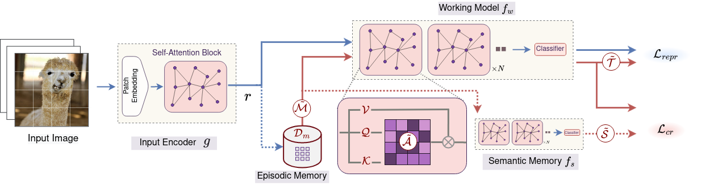

# BiRT

This is the official repository of the ICML, 2023 paper "[BiRT: Bio-inspired Replay in Vision Transformers for Continual Learning](https://arxiv.org/abs/2305.04769)" by [Kishaan Jeeveswaran](https://scholar.google.com/citations?user=JcqW3_QAAAAJ&hl=en), [Prashant Bhat](https://scholar.google.com/citations?hl=en&user=jrEETfgAAAAJ), [Bahram Zonooz](https://scholar.google.com/citations?hl=en&user=FZmIlY8AAAAJ) and [Elahe Arani](https://scholar.google.com/citations?user=e_I_v6cAAAAJ&hl=en).

TLDR: A novel representation rehearsal-based continual learning approach that, by incorporating constructive noises at various stages of the vision transformer and regularization, enables effective and memory-efficient Continual Learning.

### Schematic of MTSL:


## Setup:

OUTPUT_DIR: Directory to save output contents.<br />
DATA_DIR: Directory containing the datasets.<br />

### Datasets supported: <br />

* CIFAR-100
* ImageNet-100
* Tiny ImageNet


### BiRT Training Script:

To train BiRT on CIFAR-100 dataset 10 tasks setting with buffer size 500:
```
python main.py --seed 42 --options options/data/cifar100_10-10.yaml options/data/cifar100_order1.yaml options/model/cifar_birt.yaml --data-path <DATA_DIR> --output-basedir <OUTPUT_DIR> --base-epochs 500 --batch_mixup --batch_logitnoise --ema_alpha 0.001 --ema_frequency 0.003 --distill_version l2 --distill_weight 0.05 --distill_weight_buffer 0.001 --rep_noise_weight 1.0 --repnoise_prob 0.5 --finetune_weight 2 --representation_replay --replay_from 1 --sep_memory --num_workers 8 --csv_filename results.csv --memory-size 500 --tensorboard --epochs 500
```

### Hyperparameters for other settings: <br />

| Dataset | Num of Tasks | Buffer Size | ema_alpha | ema_frequency | distill_weight | distill_weight_buffer |
| :---: | :---: | :---: | :---: | :---: | :---: | :---: |
| CIFAR-100 | 5 | 200 | 0.0005 | 0.001 | 0.05 | 0.01 |
|  |  | 500 | 0.005 | 0.003 | 0.05 | 0.01 |
|  | 10 | 200 | 0.001 | 0.003 | 0.05 | 0.001 |
|  |  | 500 | 0.001 | 0.003 | 0.05 | 0.001 |
|  |  | 1000 | 0.0005 | 0.0008 | 0.05 | 0.01 |
|  |  | 2000 | 0.0002 | 0.0015 | 0.05 | 0.01 |
|  | 20 | 200 | 0.005 | 0.001 | 0.05 | 0.08 |
|  |  | 500 | 0.0005 | 0.003 | 0.05 | 0.1 |
| TINYIMAGENET | 10 | 500 | 0.001 | 0.003 | 0.05 | 0.01 |
|  |  | 1000 | 0.01 | 0.0008 | 0.01 | 0.001 |
|  |  | 2000 | 0.0001 | 0.008 | 0.01 | 0.0008 |
| IMAGENET- 100 | 10 | 500 | 0.0001 | 0.003 | 0.05 | 0.001 |
|  |  | 1000 | 0.0001 | 0.003 | 0.05 | 0.001 |
|  |  | 2000 | 0.01 | 0.005 | 0.01 | 0.001 |

## Cite Our Work:

If you find the code useful in your research please consider citing our paper:

<pre>
@misc{jeeveswaran2023birt,
      title={BiRT: Bio-inspired Replay in Vision Transformers for Continual Learning}, 
      author={Kishaan Jeeveswaran and Prashant Bhat and Bahram Zonooz and Elahe Arani},
      year={2023},
      eprint={2305.04769},
      archivePrefix={arXiv},
      primaryClass={cs.CV}
}
</pre>
